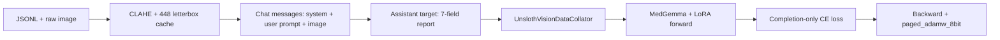

# MedGemma Chromosome VLM — Training Guide

Fine-tune **Google MedGemma-4B-IT** (vision–language) on chromosome karyotype images to produce **structured, image-grounded cytogenetics reports**. This repository contains the optimized Unsloth + LoRA training pipeline, evaluation scripts, and inference entrypoints used for the `Mukilan06/MedGemma-Chromosome-VLM` Hugging Face adapter.

Run all commands from the **repository root** (where `chromastone_vlm/` and `scripts/` live).

---

## Table of contents

1. [What this training does](#what-this-training-does)
2. [Hardware and environment](#hardware-and-environment)
3. [Dataset layout](#dataset-layout)
4. [Preprocessing pipeline](#preprocessing-pipeline)
5. [Model and adaptation strategy](#model-and-adaptation-strategy)
6. [Training hyperparameters](#training-hyperparameters)
7. [How a training step works](#how-a-training-step-works)
8. [Running training](#running-training)
9. [Checkpointing and early stopping](#checkpointing-and-early-stopping)
10. [Evaluation during and after training](#evaluation-during-and-after-training)
11. [Recommended checkpoint](#recommended-checkpoint)
12. [Inference and Hugging Face reuse](#inference-and-hugging-face-reuse)
13. [CLI reference](#cli-reference)
14. [Outputs and logs](#outputs-and-logs)
15. [Troubleshooting](#troubleshooting)
16. [Project layout](#project-layout)

---

## What this training does

The model learns to map a **single chromosome spread image** to a fixed **seven-field medical report**:

| Field | Role |
|-------|------|
| `ChromosomeCount` | Visible structure count (parsed from VQA / captions) |
| `Morphology` | Dominant morphology description (acrocentric, submetacentric, etc.) |
| `Overlap` | Whether overlap is present in the image |
| `ImageQuality` | Diagnostic usability of the image |
| `Findings` | Image-grounded observations |
| `Impression` | Conservative interpretation (no unsupported syndromes) |
| `Uncertainty` | Explicit limits of resolution / ambiguity |

**System prompt** (fixed for train and inference):

```text
You are a cytogenetics vision-language assistant. Report only image-grounded findings.
Never invent diagnoses, karyotypes, syndromes, or chromosome abnormalities that are not
directly supported by the visible morphology. When a detail is uncertain or unresolved,
say so explicitly.
```

Training uses **completion-only loss**: only the assistant’s structured report tokens contribute to the loss; the user prompt and image tokens are masked.

---

## Hardware and environment

| Item | Recommendation |
|------|----------------|
| GPU | NVIDIA L4 / A10 / similar with **≥22 GB VRAM** |
| Precision | **BF16** compute on 4-bit weights |
| RAM | Enough for 6 dataloader workers + image cache |
| Disk | Space for `dataset/cache/` PNGs and checkpoints (~300 MB+ per checkpoint) |

### Setup

```bash
python3 -m venv .venv-medgemma
source .venv-medgemma/bin/activate
pip install -r requirements.txt
```

MedGemma is **gated** on Hugging Face. Accept the model license, then authenticate:

```bash
python -c "from huggingface_hub import login; login(token='YOUR_HF_TOKEN')"
```

**Key dependencies:** PyTorch, `transformers`, `trl`, `peft`, `bitsandbytes`, `accelerate`, `unsloth`, OpenCV (CLAHE), Pillow.

Default config lives in `chromastone_vlm/optimized_config.py` (`OptimizedMedGemmaConfig`).

---

## Dataset layout

Place data under `dataset/` (symlinked from `Chromosome-dataset/dataset` if you kept the old folder):

```text
dataset/
├── processed_data/
│   ├── train/
│   │   ├── final_annotations.jsonl
│   │   └── images/
│   ├── val/
│   │   ├── annotations.jsonl
│   │   └── images/
│   └── test/
│       ├── annotations.jsonl
│       └── images/
├── cache/medgemma_l4/          # auto-built resized PNGs
│   ├── train/images_448/
│   ├── val/images_448/
│   └── test/images_448/
├── checkpoints/medgemma_optimized/
└── reports/medgemma_optimized/
```

### Splits (from a completed run)

| Split | Samples | Notes |
|-------|---------|--------|
| Train | 4,200 | `final_annotations.jsonl` |
| Val | 300 | `annotations.jsonl` |
| Test | 300 | `annotations.jsonl` |

Train distribution is **heavily skewed** toward normal count (46) and acrocentric morphology; the pipeline uses **weighted sampling** so rare buckets are seen more often (see [Balanced sampling](#balanced-sampling)).

Each JSONL record should include at least an `image` path and rich `annotation` / `vqa` fields. The code derives targets from:

- VQA answer: *"How many chromosome structures are visible"*
- `annotation.morphology_description`, `detailed_caption`, `biomedical_findings`, `cytogenetic_interpretation`, `quality_assessment`, overlap signals, etc.

---

## Preprocessing pipeline

Before training, `prepare_split_records()` builds a **cached PNG** per image:

1. Load RGB, apply EXIF transpose  
2. **CLAHE** on L channel (clip limit 1.5, 8×8 tiles) — improves contrast on metaphase spreads  
3. Autocontrast (cutoff 0.5)  
4. Thumbnail to fit inside **448×448** (bicubic)  
5. **Letterbox** on white padding (`image_pad_value=255`) to exactly 448×448  

Cached paths: `dataset/cache/medgemma_l4/{split}/images_448/{name}.png`  
Manifests: `dataset/cache/medgemma_l4/{split}/manifest.jsonl`

Force rebuild: `--force-refresh-cache`

---

## Model and adaptation strategy

| Component | Setting |
|-----------|---------|
| Primary weights | `unsloth/medgemma-4b-it-unsloth-bnb-4bit` |
| Fallback (no Unsloth) | `google/medgemma-4b-it` |
| Quantization | **4-bit NF4**, double quant, BF16 compute |
| Attention | **Flash Attention 2** when available |
| Trainer | TRL `SFTTrainer` + custom weighted sampler |
| Backend | **Unsloth** `FastVisionModel` (preferred) |

### LoRA (language-only)

| Parameter | Value |
|-----------|-------|
| Rank `r` | 32 |
| Alpha | 64 |
| Dropout | 0.0 |
| RSLoRA | enabled |
| Vision layers | **not** fine-tuned (`finetune_vision_layers=False`) |
| Language attention + MLP | fine-tuned |
| Target modules | `q_proj`, `k_proj`, `v_proj`, `o_proj`, `gate_proj`, `up_proj`, `down_proj` |

Only the **LoRA adapter** is saved per checkpoint (~250 MB), not the full 4B model.

### Effective batch size

```text
effective_batch = per_device_train_batch_size × gradient_accumulation_steps × num_gpus
                = 1 × 16 × 1 = 16
```

On an L4, one training run of 6 epochs reached **global step 1350** in ~2.6 hours (`train_runtime` ≈ 9352 s, ~2.7 samples/s).

---

## Training hyperparameters

Defaults from `OptimizedMedGemmaConfig` (overridable via CLI):

### Optimization

| Parameter | Default | Description |
|-----------|---------|-------------|
| `num_train_epochs` | 6 | Full passes over train set |
| `learning_rate` | `8e-5` | Peak LR |
| `lr_scheduler_type` | `cosine` | With `warmup_ratio=0.05` |
| `weight_decay` | 0.01 | |
| `max_grad_norm` | 0.5 | Gradient clipping |
| `optim` | `paged_adamw_8bit` | Memory-efficient AdamW |
| `seed` | 3407 | Reproducibility |

### Batching and sequence length

| Parameter | Default |
|-----------|---------|
| `per_device_train_batch_size` | 1 |
| `per_device_eval_batch_size` | 1 |
| `gradient_accumulation_steps` | 16 |
| `max_length` | 2048 |
| `dataloader_num_workers` | 6 |
| `dataloader_prefetch_factor` | 4 |
| `dataloader_pin_memory` | true |
| `dataloader_persistent_workers` | true |

### Checkpointing and validation

| Parameter | Default | Notes |
|-----------|---------|-------|
| `evaluation_strategy` | `steps` | |
| `eval_steps` | 200 | Fast **eval_loss** on 192 val samples |
| `save_steps` | 200 | Keep last 3 checkpoints |
| `save_total_limit` | 3 | Older checkpoints pruned |
| `metric_for_best_model` | `eval_loss` | Lower is better |
| `early_stopping_patience` | 4 | Stops if eval_loss stalls |
| `generation_eval_steps` | 400 | Slow **generation** metrics on 96 val samples |

### Generation (eval / inference)

| Parameter | Default | Notes |
|-----------|---------|-------|
| `generation_max_new_tokens` | 96 | Config default; inference bumps to **≥160** with retry |
| `generation_num_beams` | 1 | Greedy decoding |
| `generation_temperature` | 0.0 | Deterministic |

### Balanced sampling

| Parameter | Default |
|-----------|---------|
| `use_balanced_sampling` | true |
| `morphology_weight_power` | 0.5 |
| `chromosome_count_weight_power` | 0.35 |
| `sample_with_replacement` | true |

Per-sample weight = `1 / count(morphology)^0.5 × 1 / count(count_bucket)^0.35`, so rare morphology/count combinations are oversampled.

### Prompt variants

`enable_prompt_variants=True` rotates among four user instructions (deterministic hash per sample id) so the model does not memorize a single prompt string.

---

## How a training step works



1. **Collator** tokenizes multimodal chat (image + text) up to `max_length`.  
2. **Loss** is computed only on assistant completion tokens.  
3. **Gemma3 fix:** `model_accepts_loss_kwargs=False` to avoid `num_items_in_batch` errors.  
4. Every `eval_steps`: validation **cross-entropy** on a 192-sample subset.  
5. Every `generation_eval_steps`: optional decode + BLEU / ROUGE-L / medical consistency (slow).  
6. End of run: saves `final/` adapter unless you resume from a checkpoint.

---

## Running training

### Recommended command (L4, production)

Skips slow mid-training and final generation evals (loss-only validation is enough for checkpoint selection):

```bash
python scripts/train_medgemma_optimized.py \
  --model-name unsloth/medgemma-4b-it-unsloth-bnb-4bit \
  --fallback-model-name google/medgemma-4b-it \
  --epochs 6 \
  --train-batch-size 1 \
  --eval-batch-size 1 \
  --gradient-accumulation-steps 16 \
  --learning-rate 8e-5 \
  --image-size 448 \
  --max-length 2048 \
  --eval-steps 50 \
  --save-steps 50 \
  --generation-eval-steps 1000000 \
  --skip-final-generation-eval
```

Shorter `eval_steps` / `save_steps` (50) give finer-grained checkpoints; defaults in code are 200.

### Resume from checkpoint

```bash
python scripts/train_medgemma_optimized.py \
  --resume-from-checkpoint dataset/checkpoints/medgemma_optimized/checkpoint-250 \
  --skip-final-generation-eval
```

### Wrapper entrypoint

```bash
python train_medgemma_optimized.py   # same as scripts/train_medgemma_optimized.py
```

---

## Checkpointing and early stopping

Checkpoints are written under:

```text
dataset/checkpoints/medgemma_optimized/
├── checkpoint-250/
├── checkpoint-1300/
├── checkpoint-1350/
├── final/
├── optimized_config.json      # frozen config for this run
├── dataset_stats.json         # split statistics
├── optimized_training.log     # text log
└── training_summary.json      # runtime + best metric
```

Each `checkpoint-*` folder contains:

- `adapter_model.safetensors` — LoRA weights to load with PEFT  
- `adapter_config.json`  
- Processor / tokenizer files  
- `trainer_state.json` — step, eval history, best metric  

**Early stopping** watches `eval_loss` with patience 4. **Best checkpoint** is reloaded at end (`load_best_model_at_end=True`).

---

## Evaluation during and after training

### Fast eval (every `eval_steps`)

- Metric: **`eval_loss`** on up to 192 validation samples  
- Used to pick the best checkpoint  

### Generation eval (every `generation_eval_steps`)

- Decodes up to 96 val samples  
- Writes `dataset/reports/medgemma_optimized/generation_eval/val_step_*.json`  
- Metrics per sample: BLEU, ROUGE-L, token F1, exact match, **medical consistency**, hallucination rate  

### Manual eval after training

```bash
python scripts/evaluate_medgemma_optimized.py \
  --checkpoint-dir dataset/checkpoints/medgemma_optimized/checkpoint-250 \
  --split test \
  --sample-limit 10
```

The evaluation script uses the same structured-report completion logic as inference (minimum 160 new tokens, retry if `Impression` / `Uncertainty` missing).

---

## Recommended checkpoint

Use **`checkpoint-250`**, not the last step (`checkpoint-1350`), for deployment:

| Checkpoint | Step | Val `eval_loss` (approx.) | Why |
|------------|------|---------------------------|-----|
| **checkpoint-250** | 250 | **0.430** (best in run) | Lowest validation loss; better generation metrics in manual tests |
| checkpoint-1350 | 1350 | higher | Trained longer; tends to overfit / worse BLEU on held-out samples |

Best metric recorded in `training_summary.json`: `best_metric: 0.4303189814090729` at step 250.

Upload this adapter to Hugging Face: [Mukilan06/MedGemma-Chromosome-VLM](https://huggingface.co/Mukilan06/MedGemma-Chromosome-VLM).

---

## Inference and Hugging Face reuse

### Local checkpoint

```bash
python scripts/infer_medgemma_optimized.py \
  --checkpoint-dir dataset/checkpoints/medgemma_optimized/checkpoint-250 \
  --image dataset/cache/medgemma_l4/test/images_448/1054443.png
```

### Hugging Face adapter (same base model required)

```bash
python scripts/infer_medgemma_hf_adapter.py \
  --adapter-repo Mukilan06/MedGemma-Chromosome-VLM \
  --image dataset/cache/medgemma_l4/test/images_448/1054443.png
```

Inference details:

- Uses the same **system prompt** as training  
- Enforces all **7 labels**; retries with a completion hint if truncated  
- `max_new_tokens` effectively **≥160** (not the training-default 96)

---

## CLI reference

`scripts/train_medgemma_optimized.py` flags map to `OptimizedMedGemmaConfig`:

| Flag | Config field |
|------|----------------|
| `--data-root` | `data_root` (+ derived paths) |
| `--output-root` | `output_root` |
| `--reports-root` | `reports_root` |
| `--model-name` | `model_name` |
| `--fallback-model-name` | `fallback_model_name` |
| `--image-size` | `image_size`, `eval_image_size` |
| `--max-length` | `max_length` |
| `--epochs` | `num_train_epochs` |
| `--learning-rate` | `learning_rate` |
| `--train-batch-size` | `per_device_train_batch_size` |
| `--eval-batch-size` | `per_device_eval_batch_size` |
| `--gradient-accumulation-steps` | `gradient_accumulation_steps` |
| `--num-workers` | `dataloader_num_workers` |
| `--eval-steps` | `eval_steps` |
| `--save-steps` | `save_steps` |
| `--generation-eval-steps` | `generation_eval_steps` |
| `--resume-from-checkpoint` | `resume_from_checkpoint` |
| `--skip-final-generation-eval` | `skip_final_generation_eval` |
| `--force-refresh-cache` | rebuild image cache |
| `--disable-unsloth` | `use_unsloth=False` (Transformers + PEFT fallback) |

---

## Outputs and logs

| Path | Contents |
|------|----------|
| `dataset/checkpoints/medgemma_optimized/optimized_training.log` | Timestamped training log |
| `dataset/checkpoints/medgemma_optimized/optimized_config.json` | Full hyperparameter snapshot |
| `dataset/checkpoints/medgemma_optimized/dataset_stats.json` | Per-split morphology / count histograms |
| `dataset/checkpoints/medgemma_optimized/training_summary.json` | Runtime, steps, best metric |
| `dataset/reports/medgemma_optimized/generation_eval/` | Periodic generation eval JSON |

Large artifacts (`dataset/cache/`, checkpoints, reports) are **gitignored** — do not commit them to GitHub.

---

## Troubleshooting

| Symptom | Fix |
|---------|-----|
| Training appears stuck after an epoch | Likely **generation eval** decoding; set `--generation-eval-steps 1000000` and `--skip-final-generation-eval` |
| `num_items_in_batch` warning / error | Already handled in `ChromosomeSFTTrainer`; update `trl`/`unsloth` if it reappears |
| OOM on GPU | Keep batch size 1, increase `gradient_accumulation_steps`, or disable extra workers |
| FlashAttention import error | Pipeline falls back to default attention automatically |
| Truncated reports at inference | Use `scripts/infer_*` (160+ token budget + retry), not raw `generate(max_new_tokens=96)` |
| HF adapter load fails | Use the same 4-bit Unsloth base model; adapter alone is not a full model |
| Missing images | Check `dataset/processed_data/{split}/images/` paths in JSONL |

---

## Project layout

| Path | Purpose |
|------|---------|
| `chromastone_vlm/` | Core library (`optimized_config`, `optimized_data`, `optimized_pipeline`, metrics) |
| `scripts/` | Canonical CLI: train, evaluate, infer, HF infer |
| `train_medgemma_optimized.py` | Thin wrapper → `scripts/train_medgemma_optimized.py` |
| `evaluate_medgemma_optimized.py` | Thin wrapper → evaluate script |
| `infer_medgemma_optimized.py` | Thin wrapper → local infer |
| `infer_medgemma_hf_adapter.py` | Thin wrapper → HF infer |
| `docs/legacy/` | Historical debugging notes (not required for training) |
| `requirements.txt` | Python dependencies |

---

## Quick command summary

```bash
# Train
python scripts/train_medgemma_optimized.py --epochs 6 --eval-steps 50 --save-steps 50 \
  --generation-eval-steps 1000000 --skip-final-generation-eval

# Evaluate best checkpoint
python scripts/evaluate_medgemma_optimized.py \
  --checkpoint-dir dataset/checkpoints/medgemma_optimized/checkpoint-250 --split test

# Infer locally
python scripts/infer_medgemma_optimized.py \
  --checkpoint-dir dataset/checkpoints/medgemma_optimized/checkpoint-250 \
  --image path/to/image.png
```

For archived debugging reports and older training notes, see `docs/legacy/`.
