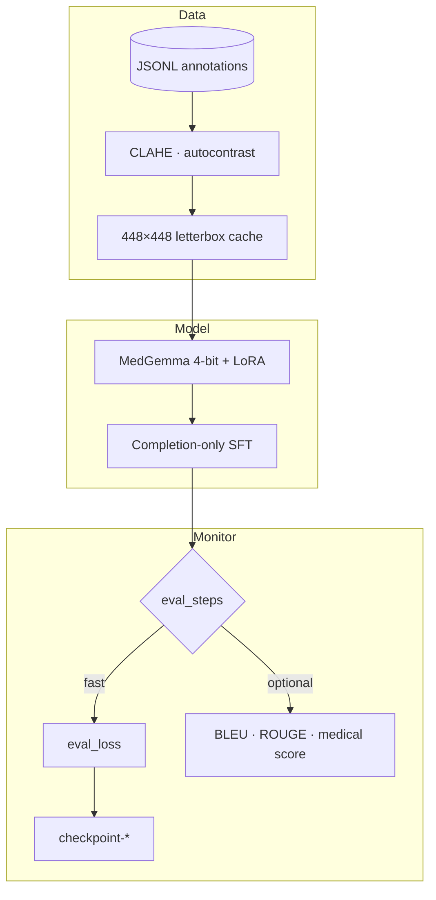

<div align="center">

# MedGemma Chromosome VLM

**Fine-tune MedGemma on karyotype images → structured, image-grounded cytogenetics reports**

[](https://huggingface.co/google/medgemma-4b-it)
[](https://huggingface.co/Mukilan06/MedGemma-Chromosome-VLM)
[]()
[]()
[]()

[Quick Start](#-quick-start) ·
[Training](#-training) ·
[Checkpoints](#-recommended-checkpoint) ·
[Inference](#-inference) ·
[Hyperparameters](#-hyperparameters) ·
[Troubleshooting](#-troubleshooting)

</div>

---

> **Run all commands from the repository root** — the folder that contains `chromastone_vlm/` and `scripts/`.

<br>

## At a glance

<table>
<tr>
<td width="25%" align="center">
<h3>4,800</h3>
<p>labeled spreads<br><sub>train · val · test</sub></p>
</td>
<td width="25%" align="center">
<h3>448×448</h3>
<p>CLAHE + letterbox<br><sub>cached PNGs</sub></p>
</td>
<td width="25%" align="center">
<h3>~250 MB</h3>
<p>LoRA adapter only<br><sub>not full 4B weights</sub></p>
</td>
<td width="25%" align="center">
<h3>checkpoint-250</h3>
<p>best val loss ≈ <b>0.430</b><br><sub>use for deployment</sub></p>
</td>
</tr>
</table>

| | |
|:---|:---|
| **Task** | Image → 7-field structured cytogenetics report |
| **Base model** | `unsloth/medgemma-4b-it-unsloth-bnb-4bit` |
| **Adaptation** | LoRA r=32 on language layers (vision frozen) |
| **Effective batch** | 16 (1 × 16 grad accum) |
| **Typical runtime** | ~2.6 h on L4 for 6 epochs / 1350 steps |

<br>

## What you get

The model maps one **chromosome spread image** to a fixed report with seven labels:

```
ChromosomeCount: 46
Morphology: Predominantly acrocentric groups with preserved overall structure.
Overlap: present
ImageQuality: Diagnostic quality is sufficient for morphology-level description.
Findings: Image-grounded structural observations from the spread.
Impression: Conservative interpretation only; no unsupported abnormality claimed.
Uncertainty: Fine cytogenetic resolution may be limited where overlap is present.
```

<details>
<summary><b>Field reference</b></summary>

| Field | Purpose |
|:------|:--------|
| `ChromosomeCount` | Visible structure count (from VQA / captions) |
| `Morphology` | Dominant morphology (acrocentric, submetacentric, …) |
| `Overlap` | Whether overlap is present |
| `ImageQuality` | Diagnostic usability |
| `Findings` | Image-grounded observations |
| `Impression` | Conservative interpretation — no invented syndromes |
| `Uncertainty` | Explicit limits of resolution |

</details>

<details>
<summary><b>System prompt</b> (train + inference)</summary>

```text
You are a cytogenetics vision-language assistant. Report only image-grounded findings.
Never invent diagnoses, karyotypes, syndromes, or chromosome abnormalities that are not
directly supported by the visible morphology. When a detail is uncertain or unresolved,
say so explicitly.
```

</details>

Training uses **completion-only loss** — only assistant report tokens are optimized; prompts and image tokens are masked.

<br>

## Quick start

### 1 · Environment

```bash
python3 -m venv .venv-medgemma
source .venv-medgemma/bin/activate
pip install -r requirements.txt
```

MedGemma is gated on Hugging Face — accept the license, then:

```bash
python -c "from huggingface_hub import login; login(token='YOUR_HF_TOKEN')"
```

### 2 · Train

```bash
python scripts/train_medgemma_optimized.py \
  --epochs 6 \
  --eval-steps 50 \
  --save-steps 50 \
  --generation-eval-steps 1000000 \
  --skip-final-generation-eval
```

### 3 · Evaluate & infer

```bash
# Evaluate
python scripts/evaluate_medgemma_optimized.py \
  --checkpoint-dir dataset/checkpoints/medgemma_optimized/checkpoint-250 \
  --split test --sample-limit 10

# Infer (local)
python scripts/infer_medgemma_optimized.py \
  --checkpoint-dir dataset/checkpoints/medgemma_optimized/checkpoint-250 \
  --image dataset/cache/medgemma_l4/test/images_448/1054443.png

# Infer (Hugging Face adapter)
python scripts/infer_medgemma_hf_adapter.py \
  --adapter-repo Mukilan06/MedGemma-Chromosome-VLM \
  --image dataset/cache/medgemma_l4/test/images_448/1054443.png
```

<br>

## Training pipeline



<details>
<summary><b>Step-by-step</b></summary>

1. **Collator** — multimodal chat (image + text), `max_length=2048`
2. **Loss** — cross-entropy on assistant tokens only
3. **Gemma3** — `model_accepts_loss_kwargs=False` (avoids `num_items_in_batch` bugs)
4. **Every `eval_steps`** — fast `eval_loss` on 192 val samples
5. **Every `generation_eval_steps`** — optional decode metrics (slow; disable in production)
6. **End** — saves `final/` adapter + reloads best checkpoint

</details>

<br>

## Dataset

```text
dataset/
├── processed_data/
│   ├── train/   → final_annotations.jsonl + images/
│   ├── val/     → annotations.jsonl + images/
│   └── test/    → annotations.jsonl + images/
├── cache/medgemma_l4/              # built automatically
│   └── {split}/images_448/*.png
├── checkpoints/medgemma_optimized/
└── reports/medgemma_optimized/
```

| Split | Samples | Annotation file |
|:-----:|:-------:|:----------------|
| Train | 4,200 | `final_annotations.jsonl` |
| Val | 300 | `annotations.jsonl` |
| Test | 300 | `annotations.jsonl` |

> Train data is skewed toward count **46** and **acrocentric** morphology. **Weighted sampling** upsamples rare buckets — see [Balanced sampling](#balanced-sampling).

Targets are built from VQA (*"How many chromosome structures are visible"*) plus `annotation.*` fields (`morphology_description`, `biomedical_findings`, `cytogenetic_interpretation`, overlap signals, etc.).

<br>

## Preprocessing

| Step | Detail |
|:-----|:-------|
| 1 | RGB load + EXIF transpose |
| 2 | **CLAHE** on L channel (clip 1.5, grid 8×8) |
| 3 | Autocontrast (cutoff 0.5) |
| 4 | Thumbnail inside **448×448** (bicubic) |
| 5 | White letterbox pad → exact 448×448 |

Cache: `dataset/cache/medgemma_l4/{split}/images_448/`  
Rebuild: `--force-refresh-cache`

<br>

## Model stack

<table>
<tr>
<td>

**Weights**

`unsloth/medgemma-4b-it-unsloth-bnb-4bit`  
Fallback: `google/medgemma-4b-it`

</td>
<td>

**Quantization**

4-bit NF4 · double quant · BF16 compute

</td>
<td>

**Attention**

Flash Attention 2 (auto-fallback)

</td>
</tr>
<tr>
<td>

**Trainer**

TRL `SFTTrainer` + weighted sampler

</td>
<td>

**Backend**

Unsloth `FastVisionModel`

</td>
<td>

**Saved artifact**

LoRA adapter ~250 MB

</td>
</tr>
</table>

### LoRA configuration

| | Value |
|:---|:---|
| Rank `r` / Alpha | **32** / **64** |
| RSLoRA | enabled |
| Vision | frozen |
| Language attn + MLP | trained |
| Targets | `q_proj` `k_proj` `v_proj` `o_proj` `gate_proj` `up_proj` `down_proj` |

```text
effective_batch = train_batch × grad_accum × GPUs = 1 × 16 × 1 = 16
```

<br>

## Hyperparameters

<details open>
<summary><b>Optimization</b></summary>

| Parameter | Default | Notes |
|:----------|:-------:|:------|
| `num_train_epochs` | 6 | |
| `learning_rate` | `8e-5` | cosine + 5% warmup |
| `weight_decay` | 0.01 | |
| `max_grad_norm` | 0.5 | |
| `optim` | `paged_adamw_8bit` | |
| `seed` | 3407 | |

</details>

<details>
<summary><b>Batching & I/O</b></summary>

| Parameter | Default |
|:----------|:-------:|
| `per_device_train_batch_size` | 1 |
| `gradient_accumulation_steps` | 16 |
| `max_length` | 2048 |
| `dataloader_num_workers` | 6 |
| `dataloader_prefetch_factor` | 4 |

</details>

<details>
<summary><b>Checkpointing & validation</b></summary>

| Parameter | Default | Notes |
|:----------|:-------:|:------|
| `eval_steps` | 200 | Fast loss on 192 val samples |
| `save_steps` | 200 | Keep last 3 |
| `metric_for_best_model` | `eval_loss` | lower is better |
| `early_stopping_patience` | 4 | |
| `generation_eval_steps` | 400 | Set `1000000` to disable |

</details>

<details>
<summary><b>Balanced sampling</b></summary>

| Parameter | Default |
|:----------|:-------:|
| `use_balanced_sampling` | true |
| `morphology_weight_power` | 0.5 |
| `chromosome_count_weight_power` | 0.35 |

```text
weight = 1 / count(morphology)^0.5 × 1 / count(count_bucket)^0.35
```

Four **prompt variants** per sample (hash of id) prevent memorizing one instruction string.

</details>

Full defaults: `chromastone_vlm/optimized_config.py` → `OptimizedMedGemmaConfig`

<br>

## Training

### Recommended command (NVIDIA L4)

Skips slow generation eval — **loss-only validation** is enough to pick checkpoints:

```bash
python scripts/train_medgemma_optimized.py \
  --model-name unsloth/medgemma-4b-it-unsloth-bnb-4bit \
  --fallback-model-name google/medgemma-4b-it \
  --epochs 6 \
  --train-batch-size 1 \
  --eval-batch-size 1 \
  --gradient-accumulation-steps 16 \
  --learning-rate 8e-5 \
  --image-size 448 \
  --max-length 2048 \
  --eval-steps 50 \
  --save-steps 50 \
  --generation-eval-steps 1000000 \
  --skip-final-generation-eval
```

### Resume

```bash
python scripts/train_medgemma_optimized.py \
  --resume-from-checkpoint dataset/checkpoints/medgemma_optimized/checkpoint-250 \
  --skip-final-generation-eval
```

<br>

## Recommended checkpoint

> **Deploy `checkpoint-250`**, not the final step `checkpoint-1350`.

| Checkpoint | Step | Val loss | Verdict |
|:-----------|:----:|:--------:|:--------|
| **`checkpoint-250`** | 250 | **0.430** | Best metric — use this |
| `checkpoint-1350` | 1350 | higher | Overfits — worse BLEU on held-out |

Published adapter: **[Mukilan06/MedGemma-Chromosome-VLM](https://huggingface.co/Mukilan06/MedGemma-Chromosome-VLM)**

<br>

## Checkpoint layout

```text
dataset/checkpoints/medgemma_optimized/
├── checkpoint-250/          ← recommended
├── checkpoint-1350/
├── final/
├── optimized_config.json
├── dataset_stats.json
├── optimized_training.log
└── training_summary.json
```

Each checkpoint folder:

| File | Role |
|:-----|:-----|
| `adapter_model.safetensors` | LoRA weights (PEFT) |
| `adapter_config.json` | Adapter metadata |
| processor / tokenizer | Multimodal I/O |
| `trainer_state.json` | Steps, eval history, best metric |

<br>

## Evaluation

| Mode | When | Metric |
|:-----|:-----|:-------|
| **Fast** | every `eval_steps` | `eval_loss` (192 val samples) |
| **Generation** | every `generation_eval_steps` | BLEU, ROUGE-L, token F1, medical consistency |
| **Manual** | after training | `scripts/evaluate_medgemma_optimized.py` |

Inference and eval use **≥160** `max_new_tokens` with automatic retry if `Impression` or `Uncertainty` is missing.

<br>

## Inference

| Source | Command |
|:-------|:--------|
| Local checkpoint | `scripts/infer_medgemma_optimized.py --checkpoint-dir …` |
| Hugging Face | `scripts/infer_medgemma_hf_adapter.py --adapter-repo Mukilan06/MedGemma-Chromosome-VLM` |

The HF repo is an **adapter only** — load with the same 4-bit Unsloth base model.

<br>

## CLI flags

<details>
<summary><code>scripts/train_medgemma_optimized.py</code> — click to expand</summary>

| Flag | Maps to |
|:-----|:--------|
| `--data-root` | `data_root` |
| `--output-root` | `output_root` |
| `--model-name` | `model_name` |
| `--epochs` | `num_train_epochs` |
| `--learning-rate` | `learning_rate` |
| `--train-batch-size` | `per_device_train_batch_size` |
| `--gradient-accumulation-steps` | `gradient_accumulation_steps` |
| `--image-size` | `image_size` |
| `--max-length` | `max_length` |
| `--eval-steps` | `eval_steps` |
| `--save-steps` | `save_steps` |
| `--generation-eval-steps` | `generation_eval_steps` |
| `--resume-from-checkpoint` | resume path |
| `--skip-final-generation-eval` | skip slow final decode |
| `--force-refresh-cache` | rebuild PNG cache |
| `--disable-unsloth` | Transformers + PEFT fallback |

</details>

<br>

## Project structure

```text
.
├── chromastone_vlm/          # core library
│   ├── optimized_config.py
│   ├── optimized_data.py
│   ├── optimized_pipeline.py
│   └── optimized_metrics.py
├── scripts/                  # canonical CLIs
│   ├── train_medgemma_optimized.py
│   ├── evaluate_medgemma_optimized.py
│   ├── infer_medgemma_optimized.py
│   └── infer_medgemma_hf_adapter.py
├── train_medgemma_optimized.py   # thin wrappers
├── requirements.txt
└── docs/legacy/                # archived notes
```

<br>

## Outputs & logs

| Path | Contents |
|:-----|:---------|
| `…/optimized_training.log` | Timestamped run log |
| `…/optimized_config.json` | Frozen hyperparameters |
| `…/dataset_stats.json` | Split histograms |
| `…/training_summary.json` | Runtime, best metric |
| `…/generation_eval/` | Periodic decode JSON |

`dataset/cache/`, checkpoints, and reports are **gitignored**.

<br>

## Troubleshooting

<details>
<summary><b>Training appears stuck</b></summary>

Likely mid-run **generation eval** (slow decoding). Use:

```bash
--generation-eval-steps 1000000 --skip-final-generation-eval
```

</details>

<details>
<summary><b>Out of memory</b></summary>

Keep `train-batch-size 1`, raise `gradient-accumulation-steps`, or lower `num-workers`.

</details>

<details>
<summary><b>Truncated reports at inference</b></summary>

Use `scripts/infer_*` — not raw `generate(max_new_tokens=96)`. The pipeline retries at ≥160 tokens.

</details>

<details>
<summary><b>HF adapter won't load</b></summary>

Adapter requires the same base: `unsloth/medgemma-4b-it-unsloth-bnb-4bit`. It is not a standalone full model.

</details>

<details>
<summary><b>Other issues</b></summary>

| Symptom | Fix |
|:--------|:----|
| `num_items_in_batch` error | Handled in `ChromosomeSFTTrainer`; update `trl` / `unsloth` |
| FlashAttention missing | Auto-fallback to default attention |
| Missing images | Verify paths in `dataset/processed_data/{split}/images/` |

</details>

<br>

## Hardware

| Resource | Minimum |
|:---------|:--------|
| GPU | NVIDIA L4 / A10 — **≥22 GB VRAM** |
| Precision | BF16 on 4-bit weights |
| Disk | Cache PNGs + ~300 MB per checkpoint |

Dependencies: PyTorch · Transformers · TRL · PEFT · bitsandbytes · accelerate · **unsloth** · OpenCV · Pillow

<br>

---

<div align="center">

**[↑ Back to top](#medgemma-chromosome-vlm)**

Historical debugging notes → [`docs/legacy/`](docs/legacy/)

</div>
